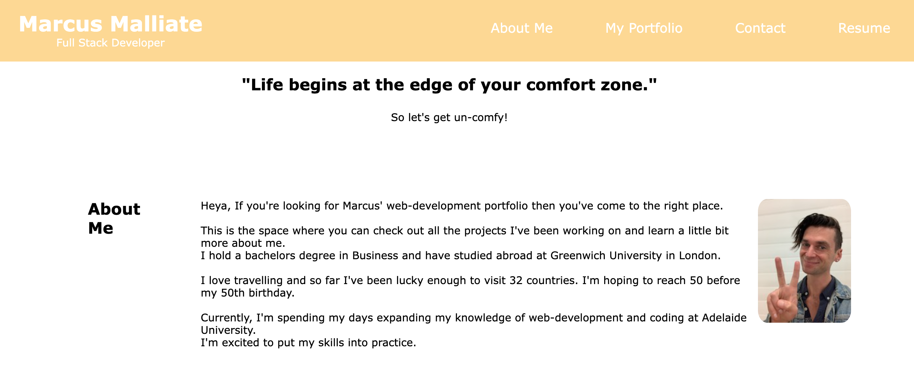
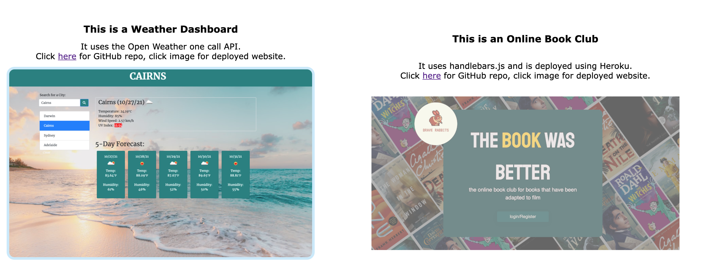
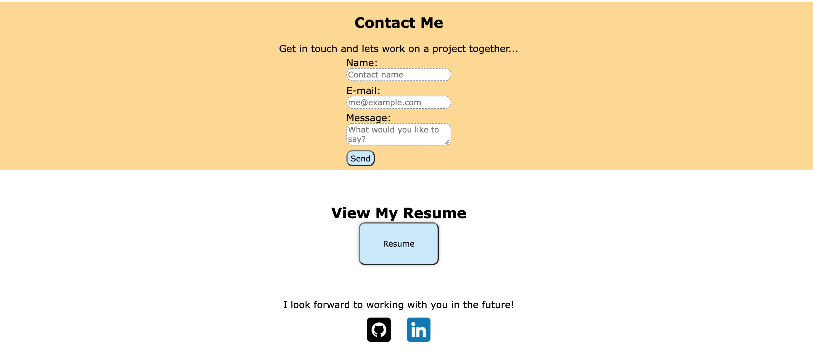

# REACT - Portfolio Update

---

## Table of Contents

1.  [Description](#Description)
2.  [Installation](#Installation)
3.  [Usage](#Usage)
4.  [License](#License)
5.  [Contributing](#Contributing)
6.  [Questions](#Questions)

 

## Description

Welcome to my web developer portfolio. This app has been built using react and has been deployed to heroku.
 

## Installation

Please clone the github repository and then run: `npm i` to install the dependencies and packages.
Once you have install the packages, run `npm start` to open the application in a local environment. It will be on localhost:3000

## Usage

Used to showcase of my knowledge of web development so far and display my portfolio for future employers and collaborators.

 

## License

This application has the following license:
[MIT License](https://opensource.org/licenses/MIT)

 

## Contributing

Please email me to discuss further.

 

## Questions

If you would like to know more or have a question you'd like to ask, please contact me via email marc.malliate@gmail.com or you may also like to checkout my work [here](https://github.com/marcmalliate)\_

 

### You may also like to view the GitHub repository which contains the code repository:

https://github.com/marcmalliate/React-Portfolio-Update

### To view my deployed portfolio please visit:

https://marcusmalliate.herokuapp.com/

 

### Screenshot of application:

Nav/Header Preview:

Projects Preview:

Contact/Footer Preview

 

 

© _2021 Marc Malliate - Professional Readme Generator_
